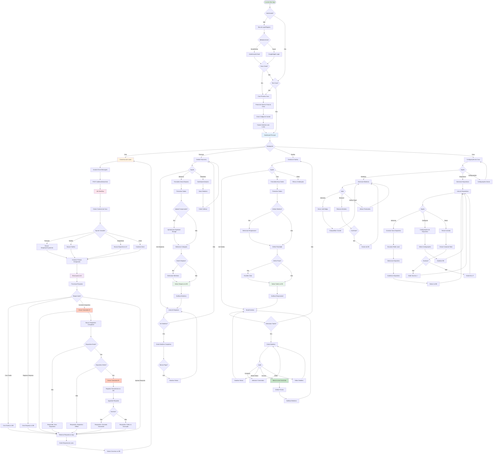
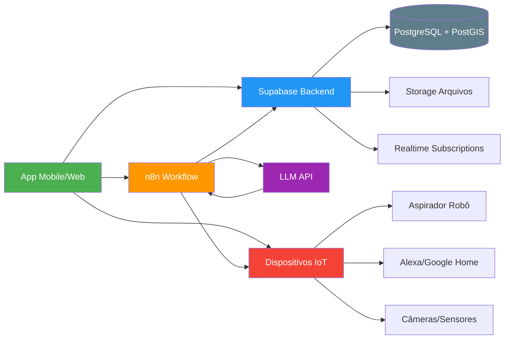
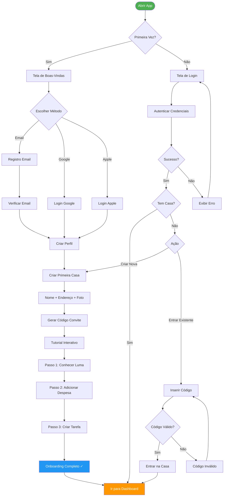
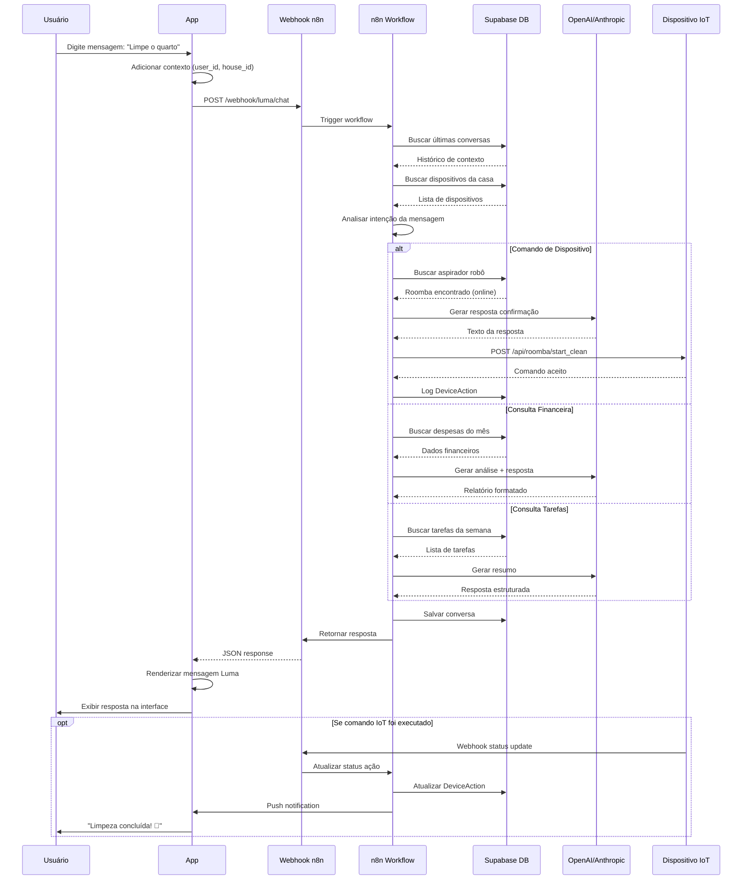

# agora crie o flowchart mermaid

***

## Flowchart Simplificado (Visão Geral)

***

## Flowchart de Autenticação e Onboarding

***

## Flowchart de Interação com Luma (Detalhado)

Esses flowcharts cobrem os principais fluxos do aplicativo Luma, desde autenticação até interações complexas com a assistente AI e dispositivos IoT.[^1][^2][^3]

⁂

[^1]: http://arxiv.org/pdf/2502.16796.pdf

[^2]: https://www.aifire.co/p/ai-integration-11-ways-to-connect-your-n8n-ai-agent

[^3]: https://binarymarvels.com/build-smart-ai-chatbots-agents-using-n8n/

